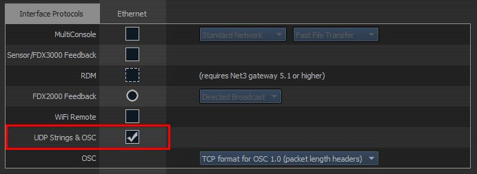

# ETC Eos Module

## Configure your console 

*This is an abbreviated guide for enabling OSC UDP control for your console. Consult your console's manual for more information.*

Exit out of your console and enter the Eos Shell (Eos Configuration Utility).

Open **Settings** and click on **Network**. Make a note of your console's IP address.

Scroll down and enable **UDP Strings & OSC** for the network interface. Save your changes by pressing the **Accept** button, then start your console.

Once your console has started, you need to enable **OSC RX** and pick a port for it to listen on. The location may vary depending on your console's version, but it should be somewhere close to **Setup>System>Show Control>OSC**.

Enable **OSC RX** and pick a port for **OSC RX Port**, like **3032**.

## Configure Companion

Add and configure the module in Companion.

The **Target IP** will be the IP address of your ETC console. The **Target Port** will be the **OSC RX Port** you configured above.

The **User ID** field lets you choose which user these commands should be executed under on your console. This user must first be setup on your console or your actions won't work. The default user in this module (and on your light console) is User ID 1.

You should use a different **User ID** if someone will be running your console while it's being controlled through Companion (especially if you use the **Custom Command** action) otherwise your actions and command lines may conflict with each other.     

## Actions

While it's not practical to create specific actions for every possible command available in your light console, some common actions/keys have been added, although the **Custom Command** action is the most flexible.

| Action              | Description                                                  |
| ------------------- | ------------------------------------------------------------ |
| Custom Command      | Runs a custom command. See the section below for more information. |
| Key: Go             | Runs the next cue in the current list. This is the same as pressing the **Go** button on your console. |
| Key: Stop/Back      | Press once to stop the current cue (if it's running), and again to move back to the previous cue in the list. This is the same as pressing the **Stop/Back** button on your console. |
| Run Cue             | Runs a specific cue in a cue list.                           |
| Run Macro | Runs a specific macro. |
| Channel Intensity   | Sets a channel's intensity to a percentage, or to keyword: `out`, `full`, `min`, `max`. |
| Group Intensity     | Sets a group's intensity to a percentage, or to a keyword: `out`, `full`, `min`, `max`. |
| Submaster Intensity | Sets a submaster's intensity to a percentage, or to a keyword: `out`, `full`, `min`, `max`. |
| Submaster Bump      | Simulates a submaster's bump button. The **State** property can be:   - Press and Release   - Press and Hold   - Release  *Hint: Add this action to a down/on action to **Press and Hold**, and a **Release** action to up/off, then make the button **Latch/Toggle**.* |

### Custom Command

This can be used to run complex commands that aren't possible to create using the above actions.

Each custom command has three properties:

- **Before**
  - **Clear command line** of anything that may already be on it.
  - **Keep command line** and append this command to it.
- **Command**: The command to run.
- **After**:
  - **Add to command line** but don't run the command.
  - **Run this command**.

You can use these properties to create actions on different buttons and piece together complete commands from different button presses.

#### Examples

| Command                       | Eos Result                                        |
| ----------------------------- | ------------------------------------------------- |
| `Go_to_cue 5`                 | Triggers cue 5 with its timing.                   |
| `Chan 12 thru 16 at 100`      | Sets intensity of channels 12-16 to 100%.         |
| `Chan 4 sneak 5`              | Sneaks channel 4 over 5 seconds.                  |
| `Chan 4 sneak 1:30`           | Sneaks channel 4 over 1 minute 30 seconds.        |
| `Chan 1.1 thru 1.12 at 50`    | Sets Channel 1 Cell 1 thru Chan 1 Cell 12 to 50%. |
| `Group 1 at out`              | Group 1 intensity to 0%.                          |
| `Chan 80 thru 100 Effect 150` | Runs effect 150 on channels 80-100.               |
| `Chan 80 thru 100 Effect`     | Stops effects on channels 80-100.                 |

